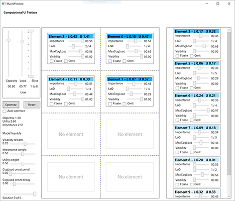

# Context-Aware Online Adaptation of Mixed Reality Interfaces


**Authors**: [David Lindlbauer](https://ait.ethz.ch/people/lindlbauer/), [Anna Maria Feit](https://ait.ethz.ch/people/feitan/), [Otmar Hilliges](https://ait.ethz.ch/people/hilliges/)  
**Publication**: [ACM UIST](https://uist.acm.org/uist2019/), New Orleans, LA, USA, October 2019  
**Project page**: [https://ait.ethz.ch/projects/2019/computationalMR/](https://ait.ethz.ch/projects/2019/computationalMR/)

## Research project description
We present an optimization-based approach for Mixed Reality (MR) systems to automatically control when and where applications are shown, and how much information they display. Currently, content creators design applications, and users then manually adjust which applications are visible and how much information they show. This choice has to be adjusted every time users switch context, i.e., whenever they switch their task or environment. Since context switches happen many times a day, we believe that MR interfaces require automation to alleviate this problem. We propose a real-time approach to automate this process based on users' current cognitive load and knowledge about their task and environment. Our system adapts which applications are displayed, how much information they show, and where they are placed. We formulate this problem as a mix of rule-based decision making and combinatorial optimization which can be solved efficiently in real-time. We present a set of proof-of-concept applications showing that our approach is applicable in a wide range of scenarios.

## Code
This repository contains the code published alongside with our UIST 2019 [paper](https://ait.ethz.ch/projects/2019/computationalMR/downloads/computationalMR_preprint.pdf). It is organised as follows: [`ConstraintUI`](ConstraintUI) contains an example of a 2D UI that is optimized using integer linear programming based on adjustable parameters. [`3d_comp_mr`](3d_comp_mr) contains Unity and Python scripts to run the optimization in real time.

### ConstraintUI Testbox
ConstraintUI is a small 2D test box to get started with constraint optimization, specifically integer linear programming. It is written in C# with Windows Presentation Foundation as UI framework. **It will therefore only run on Windows (tested with Win 10).** For more examples, visit the [Gurobi examples website](https://www.gurobi.com/documentation/8.0/examples/index.html).

##### Optimization (Gurobi)
For the optimization, we use the [Gurobi Optimizer 8.1](https://www.gurobi.com/). It is free for academic use. Please download and install it. The copy the files **Gurobi81.NET.dll** and **Gurobi81.NET.xml** from the folder *$GUROBI_INSTALL_DIR\win64\bin* into the folder *ComputationalMR\ConstraintUI\bin\Debug* (or *\Release*).

We use **Visual Studio 2017**, please open *ConstraintUI.sln* and hit build+run. **Note that it only works in 64bit configuration.**

##### Extended WPF Toolkit
For the interface, the *Extended Wpf Toolkit 3.4.0* is a also required. To install it, please open the VS solution, right-click on *References* and select *Manage NuGet packages*. On the top you will see a prompt that some packages are missing. Click *Restore* to install the missing packages.

This is how the software looks like:




The main code for the optimization is in *Optimization\Optimizer.cs*. On the top left side are the constraints (cognitive capacity and maximum number of slots to be filled), in the individual elements their input variables (importance and cognitive load when displayed, *MaxCogLoad*). You can run the optimization once by clicking the *Optimize* button, or continuously every time the cognitive capacity constraint changes it value (slider on the top).

*More detailed information will follow.*


## Computational MR
*TBA*

# Contact Information
For questions or problems please file an issue or contact [david.lindlbauer@inf.ethz.ch](mailto:david.lindlbauer@inf.ethz.ch), and use the Github issues page.

# Citation
If you use this code or data for your own work, please use the following citation:

```commandline
@inproceedings{Lindlbauer:2019,
  author = {Lindlbauer, David and Feit, Anna Maria and Hilliges, Otmar},
  title = {Context-Aware Online Adaptation of Mixed Reality Interfaces},
  booktitle = {Proceedings of the 32nd Annual ACM Symposium on User Interface Software and Technology},
  series = {UIST '19},
  year = {2019},
  isbn = {978-1-4503-6816-2/19/10},
  doi = {10.1145/3332165.3347945},
  location = {New Orleans, LA, USA},
  numpages = {10},
  publisher = {ACM},
  address = {New York, NY, USA},
}
```
